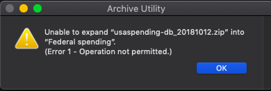

<b>SPENDING DATA</b>
Issues:
1. According to database installation <a href="https://files.usaspending.gov/database_download/usaspending-db-setup.pdf">instructions</a>, 50 Gb needed locally for installation. After clearing space on my local hard drive, I now have nearly 200 Gb (of 500 Gb) free. When I tried to unzip the 46 Gb file that I downloaded, I received the following error message. 

2. The instructions also state that 1 TB is needed "to store the fully restored database." This seems to imply that I will need to run the spending data from an Amazon cluster. 
3. I have reviewed the data dictionary for the spending data, but do not yet understand this well enough to have determined how I will segment this data.  
<b>VOTING DATA</b> 
I have manually cleaned the voting data for 2016 and 2014. I am about 2/3 complete with the manual cleaning of the 2012 vote counts. Electoral features that I intend to analyze include: 
1. How many candidates ran for each congressional seat? 
2. What was the % margin of victory? 
3. What is the average number of votes cast for each seat? (I plan to use this as a proxy for the number of constituents represented.)
