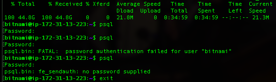
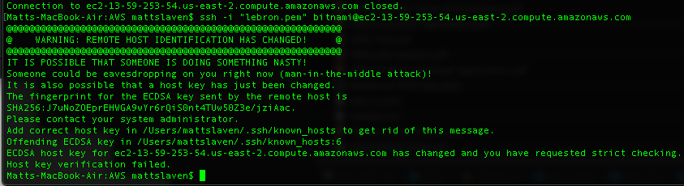

<b>AMAZON WEB SERVICES (AWS)</b> 
Yesterday led to continued frustration attempting to setup AWS for the federal spending data.  
<b>Issues:</b> 
<ul><li>After spending another half day attempting to access a command line from the Amazon Relational Database Service (RDS) Postgres instance that I had created, I found nothing leading to the conclusion that this is possible.
<li>As a fallback, I next decided to create an Elastic Compute Cloud (EC2) on which I would use PostgreSQL. It seemed logical to search for an Amazon Machine Image (AMI) that already had PostgreSQL included. I selected a Bitnami instance.
<li>After creating this instance, I used <code>curl -O https://files.usaspending.gov/database_download/usaspending-db_20181113.zip</code> to download the 45 Gb zipped file. This process lasted 35 minutes at an average transfer speed of 21.8 Mbps.
<li>When I tried to login into psql, I was asked for a password. Unfortunately, I was unable to determine what this was. 
  
<li>After consulting Dan in the morning, he suggested looking for readme files that would have been installed in the EC2 root directory. Unfortunately, I was no longer able to log into the EC2 instance this morning.
  
</ul>
<b>NEXT STEPS</b> 
<ul><li>One way or another, I will unzip & restore the spending database over the holiday weekend. If necessary, I will do this using an externally attached hard drive.
<li>I have started a <a href="https://docs.google.com/spreadsheets/d/e/2PACX-1vRK3pOX3PdGgw3vQIHcgb60ZwKzcnq-l4DMrn5LVcWVl_eozOUcX41WWVO-UDyFj4ER-zVTKO2KuaeJ/pubhtml">Google Sheets document</a> mock-up of what the data should look like once I have distilled the spending data using psql.
<li>I have drafted a <a href="http://localhost:8888/notebooks/Documents/Galvanize/Capstone/scratch_2018-11-21.ipynb">Jupyter notebook</a> incorporating some Decision Tree code from when we covered this in class.
</ul>
